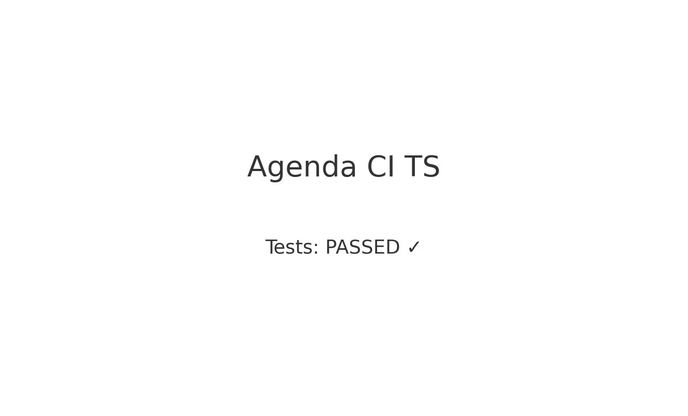

# PROVA-CI-HECLAIR-SOUSA

Projeto de **Agenda (TypeScript)** com **Jest** e **GitHub Actions** usando **um único job** (Node 20.x), otimizado para rodar exatamente como está no seu computador.

## 👤 Autor
**Heclair Sousa**

---

## 🚀 Como rodar localmente (passo a passo)
```bash
# 1) Instalar dependências
npm ci

# 2) Rodar testes com cobertura
npm test

# 3) Compilar TypeScript
npm run build

# 4) Executar a demonstração
npm start
```

> Se mudar o nome/branch principal para `master`, mantenha o mesmo no CI abaixo.

---

## 🔧 `package.json` (trecho relevante)
Use **Jest 29** com **ts-jest 29** (compatíveis entre si).

```json
{
  "scripts": {
    "dev": "ts-node src/index.ts",
    "build": "tsc",
    "test": "jest --coverage",
    "start": "node dist/src/index.js"
  },
  "devDependencies": {
    "@types/jest": "^29.5.12",
    "jest": "^29.7.0",
    "ts-jest": "^29.2.5",
    "ts-node": "^10.9.2",
    "typescript": "^5.6.3"
  }
}
```

Se você estiver com Jest 30 instalado, remova `node_modules` e **volte para a 29**:
```bash
rm -rf node_modules package-lock.json
npm install -D jest@29.7.0 ts-jest@29.2.5 @types/jest@29.5.12 typescript@5.6.3 ts-node@10.9.2
npm ci
```

---

## ⚙️ `jest.config.cjs`
Coloque este arquivo na raiz e **apague** outras configs do Jest para não dar conflito.
```js
/** @type {import('jest').Config} */
module.exports = {
  testEnvironment: 'node',
  preset: 'ts-jest',
  collectCoverage: true,
  coverageDirectory: 'coverage',
  collectCoverageFrom: ['**/*.ts', '!**/*.d.ts', '!dist/**', '!**/*.test.ts'],
  testMatch: ['**/?(*.)+(spec|test).ts'],
  verbose: true
};
```

---

## 🧩 `tsconfig.json` (essencial)
Garante build para `dist/` e que o `start` rode `dist/src/index.js`.
```json
{
  "compilerOptions": {
    "target": "ES2020",
    "module": "commonjs",
    "rootDir": ".",
    "outDir": "dist",
    "lib": ["ES2020"],
    "types": ["node", "jest"],
    "strict": true,
    "skipLibCheck": true,
    "sourceMap": true
  },
  "include": ["src", "App.ts", "App.test.ts"],
  "exclude": ["node_modules", "dist"]
}
```

---

## 🏗️ CI — `.github/workflows/ci.yml` (um único job)
Altere `branches` para `master` se seu repositório usar `master`.

```yaml
name: CI Pipeline (TS)

on:
  push:
    branches: [ master ]
  pull_request:
    branches: [ master ]

jobs:
  build-and-test:
    runs-on: ubuntu-latest

    steps:
      - name: Checkout do repositório
        uses: actions/checkout@v4

      - name: Configurar Node.js 20.x
        uses: actions/setup-node@v4
        with:
          node-version: 20.x
          cache: npm

      - name: Instalar dependências
        run: npm ci

      - name: Executar testes
        run: npm test

      - name: Build
        run: npm run build
```

> Se o Actions não iniciar: verifique **nome da branch** e o **path do arquivo** `.github/workflows/ci.yml`. Confira também se o repositório não está com Actions desabilitado.

---

## 🖼️ Print de demonstração
Abaixo um *print* meramente ilustrativo para o README:



---

## ✅ Checklist do que está implementado
- [x] YAML do GitHub Actions em `.github/workflows/ci.yml`
- [x] Execução automática em push/pull request na branch principal
- [x] Testes executando com sucesso (Jest 29 + ts-jest 29)
- [x] Organização correta do projeto e scripts no `package.json`
- [x] Sem banco real: armazenamento em memória (mock)

---

Desenvolvido por **Heclair Sousa**
